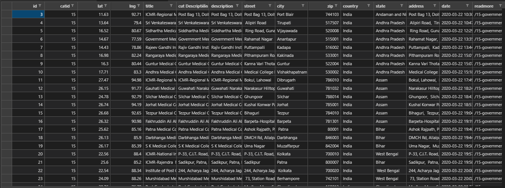

# COVID-19 Testing Laboratories - India

List of ~2,850 geotagged COVID-19 testing labs in India.

- [Download Latest CSV](testing-facilities.csv)
- Archived every week from [ICMR](https://covid.icmr.org.in/testing-facilities). See [data](data/) folder.

H/T [Raj Bhagatt](https://twitter.com/rajbhagatt/status/1422830734935400448), [Chinmay Tumbe](https://twitter.com/ChinmayTumbe/status/1422812865170345987)

Reach out to [Pratap Vardhan](https://pratapvardhan.com/) if you've any questions.